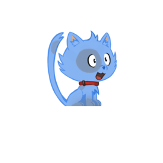

# Cat Friends App

This is a Progressive Web App (PWA), built with Create React App, that demonstrates:  

- State Management using Redux 
- Performance enhancement through Code Splitting
- REST API Integration with JSONPlaceholder
- Lighthouse Score: 100% across the board :)

----------------------------------------------------------
## Scope / About

This is a project that forms part of the courses: The Complete Web Developer in 2020: Zero to Mastery on [Udemy](https://www.udemy.com/course/the-complete-web-developer-zero-to-mastery), and The Complete Junior to Senior Web Developer Roadmap (2020) on [Udemy](https://www.udemy.com/course/the-complete-junior-to-senior-web-developer-roadmap).  

----------------------------------------------------------
## Project Status

As of May 2020 it is stilll in development, but is functional and can be viewed [here](https://phat-marc.github.io/catapp/)

----------------------------------------------------------
## Tech Used

	- Create React App
	- React
	- React-DOM
	- React-Redux
	- Redux
	- Redux-Logger
	- Redux-Thunk
	- Tachyons
	- HTML/CSS/JS 
	- Node.js
	- NPM 
	- Git Bash
	- GH-Pages

----------------------------------------------------------

## Resources

  - [Cats](https://robohash.org)
  - [Favicon](https://realfavicongenerator.net)
  - [API](https://jsonplaceholder.typicode.com/)